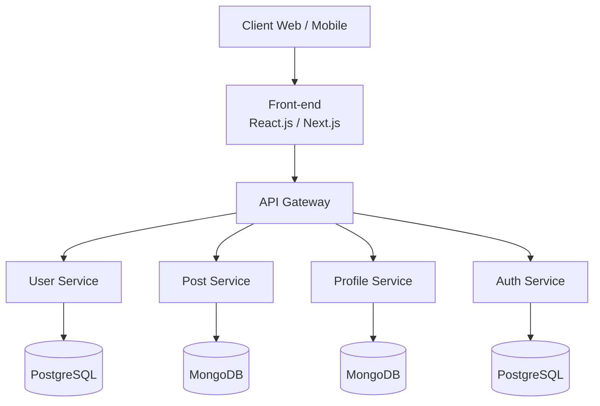

# Breeze

## Matrice des permissions

| Fonctionnalité (Fx) | Visiteur | Utilisateur | Modérateur | Administrateur |
| :--- | :---: | :---: | :---: | :---: |
| **Fx1.** Création de comptes utilisateurs | ✅ | ❌ | ❌ | ✅ |
| **Fx2.** Authentification sécurisée | ❌ | ✅ | ✅ | ✅ |
| **Fx3.** Publication de messages courts | ❌ | ✅ | ✅ | ✅ |
| **Fx4.** Affichage des messages sur le profil | ❌ | ✅ *(seulement le sien)* | ✅ | ✅ |
| **Fx5.** Flux chronologique des messages | ❌ | ✅ | ✅ | ✅ |
| **Fx6.** Liker un post | ❌ | ✅ | ✅ | ✅ |
| **Fx7.** Répondre à un post sous forme de commentaire | ❌ | ✅ | ✅ | ✅ |
| **Fx8.** Répondre à un commentaire sur un post | ❌ | ✅ | ✅ | ✅ |
| **Fx9.** Suivre ou être suivi par d'autres utilisateurs | ❌ | ✅ | ✅ | ✅ |
| **Fx10.** Profil utilisateur avec informations de base | ❌ | ✅ | ✅ | ✅ |
| **Fx11.** Liste des messages publiés par l'utilisateur sur le profil | ❌ | ✅ | ✅ | ✅ |
| **Fx12.** Ajout de tags aux messages | ❌ | ✅ | ✅ | ✅ |
| **Fx13.** Recherche de posts via des tags | ❌ | ✅ | ✅ | ✅ |
| **Fx14.** Notifications pour les mentions | ❌ | ✅ | ✅ *(modération)* | ✅ *(administration)* |
| **Fx15.** Notifications pour les likes | ❌ | ✅ | ❌ | ❌ |
| **Fx16.** Notifications pour les nouveaux followers | ❌ | ✅ | ❌ | ❌ |
| **Fx17.** Système de messages privés entre utilisateurs | ❌ | ✅ | ✅ | ✅ |
| **Fx18.** Ajout d’images aux messages | ❌ | ✅ | ✅ | ✅ |
| **Fx19.** Ajout de vidéos aux messages | ❌ | ✅ | ✅ | ✅ |
| **Fx20.** Signalement de contenu inapproprié | ❌ | ✅ | ✅ | ✅ |
| **Fx21.** Suspension ou bannissement des utilisateurs | ❌ | ❌ | ✅ | ✅ |
| **Fx22.** Interface multi-langues | ❌ | ✅ | ✅ | ✅ |
| **Fx23.** Thème personnalisé | ✅ | ✅ | ✅ | ✅ |

## Architecture et Stack Technique

L’application repose sur une architecture web moderne séparant clairement le **front-end**, le **back-end**, les **services métiers** et les **bases de données**.

### Schéma d’architecture

---

## Back-end — Node.js & Express

Le back-end est développé avec **Node.js** et **Express.js**. Il est organisé en plusieurs services afin de séparer les responsabilités principales de l’application.

### Technologies utilisées

| Élément | Technologie | Rôle |
| :--- | :--- | :--- |
| Runtime | Node.js | Exécution du serveur back-end |
| Framework API | Express.js | Création des routes et des API REST |
| Authentification | JWT | Gestion sécurisée des sessions utilisateur |
| Base de données relationnelle | PostgreSQL | Stockage des données structurées |
| ORM relationnel | Sequelize | Communication avec PostgreSQL |
| Base de données NoSQL | MongoDB | Stockage des données flexibles |
| ODM MongoDB | Mongoose | Communication avec MongoDB |
| Conteneurisation | Docker | Déploiement et isolation des services |

### Services back-end

| Service | Responsabilité principale | Base de données associée |
| :--- | :--- | :--- |
| Auth Service | Gestion de l’inscription, de la connexion et des tokens JWT | PostgreSQL |
| User Service | Gestion des utilisateurs, des rôles et des permissions | PostgreSQL |
| Post Service | Gestion des messages, commentaires, likes, tags et médias | MongoDB |
| Profile Service | Gestion des profils utilisateurs et des informations publiques | MongoDB |
| API Gateway | Point d’entrée centralisé entre le front-end et les services back-end | Aucune base directe |

### Sécurité

| Élément | Description |
| :--- | :--- |
| Authentification JWT | Sécurisation des sessions avec des tokens |
| Gestion des rôles | Permissions différentes pour les utilisateurs, modérateurs et administrateurs |
| Protection des routes | Accès limité selon le rôle et l’état d’authentification |
| Gestion des erreurs | Réponses d’erreur claires et centralisées côté API |
| CORS | Contrôle des échanges entre le front-end et le back-end |

### Performance et déploiement

| Élément | Description |
| :--- | :--- |
| Docker | Facilite le déploiement et l’exécution des services |
| Séparation des services | Améliore la lisibilité, la maintenance et l’évolutivité |
| PostgreSQL | Adapté aux données structurées comme les utilisateurs et l’authentification |
| MongoDB | Adapté aux données flexibles comme les posts, profils et contenus associés |

---

## Front-end — React & Next.js

Le front-end est développé avec **React.js** et **Next.js** afin de proposer une interface moderne, responsive et adaptée aux différents rôles de l’application.

### Technologies utilisées

| Élément | Technologie | Rôle |
| :--- | :--- | :--- |
| Bibliothèque UI | React.js | Construction des composants d’interface |
| Framework front-end | Next.js | Organisation de l’application, routage et rendu optimisé |
| Style | Tailwind CSS | Création rapide d’une interface responsive |
| Requêtes HTTP | Axios | Communication avec l’API back-end |
| Routage | Next.js / React Router | Navigation entre les pages |
| Sessions | JWT | Gestion de l’état de connexion utilisateur |

### UX/UI et responsive design

| Élément | Description |
| :--- | :--- |
| Mobile-first | Interface pensée en priorité pour les écrans mobiles |
| Responsive design | Adaptation aux mobiles, tablettes et ordinateurs |
| Gestion des erreurs UI | Affichage de messages d’erreur clairs côté utilisateur |
| Redirection après authentification | Redirection automatique selon l’état de connexion |
| Affichage selon les rôles | Interface adaptée aux visiteurs, utilisateurs, modérateurs et administrateurs |

### Gestion des sessions

| Élément | Description |
| :--- | :--- |
| Stockage du JWT | Conservation du token après connexion |
| Vérification de session | Contrôle de l’état d’authentification |
| Pages protégées | Accès réservé aux utilisateurs connectés |
| Déconnexion | Suppression du token et retour vers les pages publiques |
